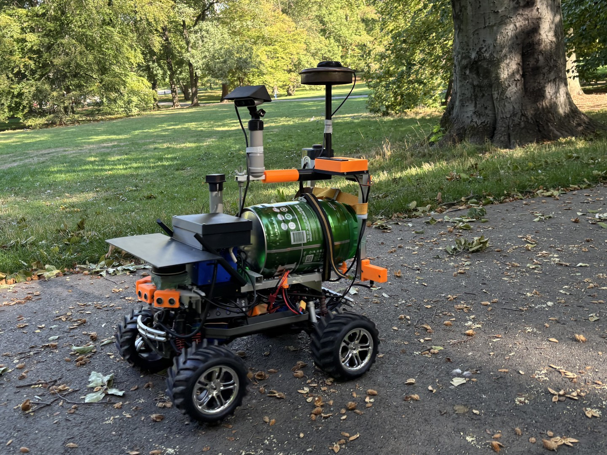
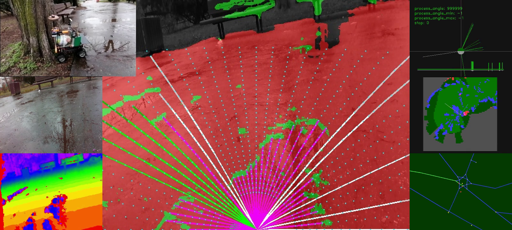

# istrorsx-rt — autonomous delivery robot software

ROS 2 software of the delivery robot of the **Istrobotics** team — a hobby build on a Traxxas E-Maxx
chassis and an NVIDIA Jetson, competing at Robotour.

Robotour is an outdoor delivery contest: the robot has to drive autonomously along park paths, pick
up a load at a place given by a QR code, deliver it to another, and return to the service area.



## What is published here

The repository is published as **snapshots of the development tree**, not as its day-to-day history.
The current one is the state the robot drove at **Robotour 2026 in Praha, Stromovka (Královská
obora), on 2026-09-19**; later seasons will be published here the same way.

## Where it came from

The project started as a **working 1:1 port of the 2025 sources
([lnx-git/istro-rt](https://github.com/lnx-git/istro-rt)) to ROS 2** — one node per legacy pthread,
the same data flow, the same algorithms and constants, and the old code's quirks kept rather than
tidied away, so that the robot's behaviour stayed comparable while the structure changed. Deviations
were made only where they had a reason, and each one is argued in `doc/ai/01_architecture.md`.

That is the origin, not the plan. From here the project goes its own way, and parts of it already
have: the UPS monitoring, the map export service, four interchangeable neural-network servers and
the log analyzers have no counterpart in the original.

ROS 2 Jazzy, C++17, `colcon`, `log4cxx` logging into `logout/`.

Twelve nodes in four packages:

| Package | Nodes |
|---|---|
| `istrobtx` | shared legacy scaffolding, no ROS interfaces |
| `istrorsx_hw` | `ctrlboard_node`, `gps_node`, `lidar_node`, `camera_node` (×2, front/rear), `ups_node` |
| `istrorsx_core` | `navigation_node`, `planner_node`, `drive_node`, `vision_node`, `save_node`, `telemetry_node`, `keyboard_node` |
| `istrorsx_bringup` | `full.launch.py` — the whole graph in one launch |

Position is a global part and a local part: GPS (1 Hz, consumer receiver) snapped onto the park's
compiled-in map graph, and dead-reckoning from the wheel encoder and the compass for the local
obstacle grid. Obstacles come from a neural-network road segmentation on the front RGB image, from
the depth cameras, from a 2D lidar and from five ultrasonic sensors.

## What the robot sees



`save_node` writes this composite for every processed frame, and it is the fastest way to understand
what the robot decided and why. Left column: the rear camera, the front camera and its depth image.
Centre: the front frame with the neural network's road mask (red drivable, green not) and the
planner's candidate directions — magenta rays are blocked, green ones free, white is the chosen
heading. Right: the lidar scan, the local obstacle grid built from all sensors, and the park's map
graph with the planned route.

## Hardware it ran on

| | |
|---|---|
| Chassis | Traxxas E-Maxx 3903, servo steering + brushless ESC |
| Computer | NVIDIA Jetson Orin Nano Super, 8 GB, JetPack 7.2.1 |
| Control board | Arduino Mega — servo, ESC, encoder, sonars, emergency button, displays, LEDs; a second board carries the IMU |
| Cameras | Intel RealSense D435i (front) + D435 (rear) |
| Lidar | RoboPeak RPLIDAR 360, 7 Hz |
| GPS | Holux M-215+ GPS/GLONASS through `gpsd` |
| Compass | Bosch BNO055 (fused Euler angles) |
| Odometry | single-channel Hall encoder on the drivetrain |
| Power | 2× HV-LiPo 7.6 V for the drive, a 3×21700 UPS module for the computer |

## Layout

```
src/                 the four ROS 2 packages
conf/                log4cxx config, DDS profile, OSM park maps, vision masks
script/log/          post-mortem log analyzers (WrongWay, compass calibration, odometry vs GPS)
script/test/         synthetic-message test scripts for single nodes
script/install/      one-time dependency installers
script/visionn_*/    the neural-network inference servers, one directory per model variant
sample/              sample camera frames
doc/ai/              architecture and rationale, specifications, installation
doc/kml/             park maps as KML, screenshots, QR codes for the navigation points
_full_launch.sh      start everything
*_node_run.sh        start one node with the arguments it needs
```

## Build and run

Ubuntu 24.04 + ROS 2 Jazzy. System dependencies and how to install them are in
`doc/ai/04_installation.md` (log4cxx, OpenCV, gpsd client, GeographicLib, RPLIDAR SDK,
librealsense2).

```bash
source /opt/ros/jazzy/setup.bash
colcon build
source install/setup.bash
```

Before the launch, two things are started by hand and left running:

```bash
./_gpsd_run.sh                # configures the GPS module, starts gpsd, records raw NMEA
./_visionn_server_run.sh      # the neural-network inference server
./_full_launch.sh             # every ROS node
```

Serial devices, the route, speeds and the calibration constants are all arguments of
`_full_launch.sh` — read its header, it documents each one.

**The park map is a compile-time switch** (`src/istrobtx/include/system.h`): exactly one
`ISTRO_MAP_*` is active, and its graph is generated into `navmap_data.cpp` from the `.osm` file.
Adding a new venue therefore means generating that data from OSM and rebuilding — the exporter is
`navigation_node`'s `/robot/navmap_export` service, driven by `script/navmap_export.sh`. This
snapshot is set to `ISTRO_MAP_PRAHA_STROMOVKA_JV`, the south-east part of Stromovka used at the
competition.

## Neural-network inference servers

`vision_node` does not run the network itself. It sends a frame over a TCP socket to a separate
Python server and gets a road mask back, which keeps the model's runtime out of the ROS process.
Four interchangeable variants are included, selected with `visionn_server_variant:=`:

| Variant | Model | Runtime |
|---|---|---|
| `segfb0` | SegFormer-B0 road segmentation | ONNX Runtime, CPU |
| `segfb0-trt` | the same model | TensorRT, Jetson GPU |
| `roadyolo` | YOLO11s-seg road segmentation | ONNX Runtime, CPU |
| `roadyolo-trt` | the same model | TensorRT, Jetson GPU |

The CPU variants exist so different models can be compared on a machine without a GPU. The robot
drove the competition on `segfb0-trt`: SegFormer separated path from grass more reliably than the
YOLO model on the day. The pre/postprocess code is kept identical between a model's CPU and TensorRT
variant, so the two runtimes cannot drift apart.

**On the model files.** The `.engine` files are TensorRT engines built on this exact Jetson and
JetPack version — they are not portable and must be rebuilt from the matching `.onnx` on any other
machine. The weights were trained in separate projects that are not part of this repository, and
**they are not under this repository's MIT licence** — see [`license/NOTICE.md`](license/NOTICE.md).

## Log analyzers

Every drive leaves a `logout/istro_*.log`. `script/log/` holds read-only analyzers that answer the
questions that came up after real drives, each writing its findings in the same log-line format:

* `wrongway_analyze.py` — every "driving the wrong way" reversal: was it triggered correctly, did the
  robot actually move, and if not, why;
* `calib_analyze.py` — the compass-to-north calibration against GPS course;
* `odom_analyze.py` — encoder pulses and the commanded speed against GPS speed and displacement on
  straight stretches (`odom_analyze.md` explains every value it prints).

## Related

* **Robotour** — the outdoor delivery contest this robot is built for:
  [robotika.cz/competitions/robotour](https://robotika.cz/competitions/robotour/en)
* **[lnx-git/istro-rt](https://github.com/lnx-git/istro-rt)** — the 2025 legacy application this is a
  port of, and the robot's earlier seasons.

## Attribution

* Park maps in `conf/*.osm` and `doc/kml/` are derived from **OpenStreetMap** data,
  © OpenStreetMap contributors, available under the [Open Database License](https://www.openstreetmap.org/copyright).
* The road-segmentation models were trained in separate projects that are not part of this
  repository and keep their own licences; see [`license/NOTICE.md`](license/NOTICE.md).

## Licence

Source code and documentation: **MIT** ([`license/LICENSE`](license/LICENSE)).

The neural-network model files and the map data are third-party material and keep their own terms —
the YOLO models are **AGPL-3.0** (trained with Ultralytics), the SegFormer models carry NVIDIA's
non-commercial restriction, and the maps are OpenStreetMap data under ODbL. Each is listed in
[`license/NOTICE.md`](license/NOTICE.md), with the same note repeated in the directory it sits in. Read it before
reusing a model file; the code itself you can take under MIT.
